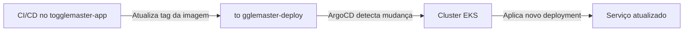

# ToggleMaster – GitOps Repository

[](https://github.com/togglemaster-fiapdevops/togglemaster-deploy/actions)
[](https://argoproj.github.io/argo-cd/)
[](https://kustomize.io/)
[](LICENSE)

---

Este repositório contém os **manifests Kubernetes** do projeto **ToggleMaster** e é o coração do fluxo **GitOps**.  
Ele é **gerenciado automaticamente** pelos pipelines de CI/CD do repositório [`togglemaster-app`](https://github.com/togglemaster-fiapdevops/togglemaster-app) e **sincronizado continuamente** pelo **ArgoCD** no cluster EKS.

> **Tudo o que está aqui é aplicado automaticamente no cluster. Nada é feito manualmente.**

---

## Estrutura do Repositório

```plaintext
k8s/
├── base/                         # Manifests base (comuns a todos os ambientes)
│   ├── cluster-config/           # Configurações do cluster (aws-auth)
│   ├── jobs/                     # Jobs de inicialização (ex: migrations)
│   │   └── sql/                  # Scripts SQL para cada serviço
│   └── services/                 # Manifestos de cada microsserviço
│       ├── auth/
│       ├── flag/
│       ├── targeting/
│       ├── evaluation/
│       └── analytics/
├── overlays/                     # Customizações por ambiente
│   └── prod/                     # Overlay de produção (referencia os bases)
└── kustomization.yaml            # Kustomize raiz (agrega todos os recursos)
```

---

## Fluxo GitOps



1. Um desenvolvedor faz push no repositório `togglemaster-app`.
2. O pipeline **Go** executa testes e escaneia vulnerabilidades.
3. O pipeline **Docker** constrói a imagem, publica no ECR e **atualiza a tag da imagem** no arquivo `kustomization.yaml` do serviço correspondente (dentro de `k8s/base/services/<servico>/`).
4. O ArgoCD (instalado no cluster) **detecta a mudança** no repositório (polling a cada 3 minutos) e **sincroniza** automaticamente os manifests.
5. O Kubernetes **rollout** a nova versão do serviço.

---

## Serviços Gerenciados

| Serviço | Pasta | Imagem no ECR |
|---------|-------|---------------|
| Auth | `auth` | `auth-service` |
| Flag | `flag` | `flag-service` |
| Targeting | `targeting` | `targeting-service` |
| Evaluation | `evaluation` | `evaluation-service` |
| Analytics | `analytics` | `analytics-service` |

---

## Como Atualizar Manualmente (não recomendado)

Embora o fluxo automático seja o padrão, você pode forçar uma atualização local:

```bash
# Clone o repositório
git clone https://github.com/togglemaster-fiapdevops/togglemaster-deploy.git
cd togglemaster-deploy

# Altere a tag da imagem (exemplo para auth)
cd k8s/base/services/auth
kustomize edit set image auth-service=123456.dkr.ecr.us-east-1.amazonaws.com/auth-service:novo-tag

git add .
git commit -m "feat: update auth image to novo-tag"
git push origin deploy
```

> **Atenção:** A branch `deploy` é atualizada automaticamente pelos workflows. Prefira sempre o fluxo automatizado via CI/CD.

---

## Segredos e Configurações

Os segredos (credenciais de banco de dados, Redis, etc.) são injetados no cluster via **Secrets do Kubernetes**, criados a partir do **AWS Systems Manager (SSM) Parameter Store**.  
Nenhum segredo está versionado neste repositório.

---

## Como Testar Localmente

Para validar os manifests antes de aplicar:

```bash
# Instale o kustomize (se ainda não tiver)
brew install kustomize   # macOS
# ou baixe de https://kustomize.io/

# Renderize todos os recursos
kustomize build k8s/overlays/prod

# Verifique se os YAMLs são válidos
kustomize build k8s/overlays/prod | kubectl apply --dry-run=client -f -
```

---

## Status no ArgoCD

Após a instalação do ArgoCD, você pode acessar a interface web para visualizar o status de cada aplicação:

```bash
#Update config
aws eks update-kubeconfig --region <region> --name <cluster-name>

# Obter a URL do Load Balancer
kubectl get svc argocd-server -n argocd -o jsonpath="{.status.loadBalancer.ingress[0].hostname}"

# Obter a senha inicial do admin
kubectl -n argocd get secret argocd-initial-admin-secret -o jsonpath="{.data.password}" | base64 -d
```

Usuário: `admin`

---


- [Repositório de Aplicação (togglemaster-app)](https://github.com/devops-tm/togglemaster-app) – onde estão os workflows CI/CD.
- [ArgoCD](https://argoproj.github.io/argo-cd/) – ferramenta de GitOps utilizada.
- [Kustomize](https://kustomize.io/) – gerenciador de manifests Kubernetes.

---
